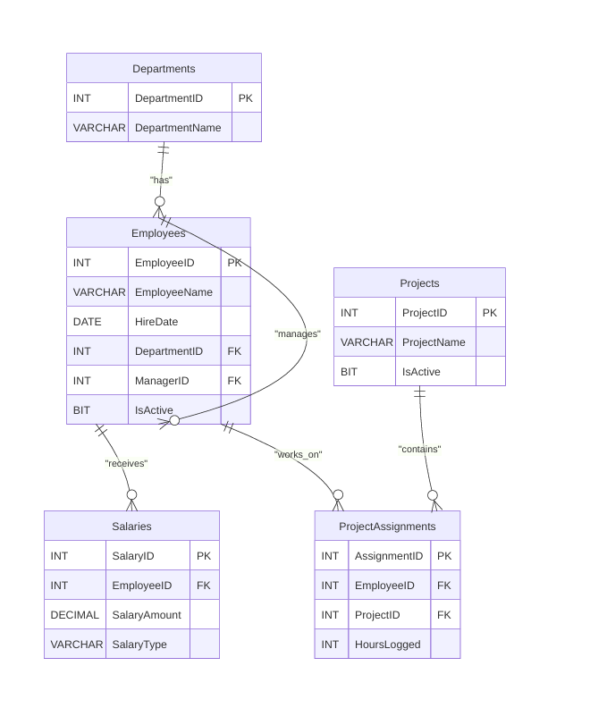

# Company Database System - SQL Tasks

This repository contains SQL scripts to design, populate, and query a database schema for ABC Inc. The system manages departments, employees, salaries, projects, and employee assignments.

## Database Schema

The database consists of the following tables:
* **Departments**: Stores department names.
* **Employees**: Stores employee details, hire date, department ID, active status, and manager ID (self-referencing manager relationship).
* **Salaries**: Tracks salary amount and pay structure (Monthly or Annual).
* **Projects**: Tracks project names and their active status.
* **ProjectAssignments**: Links employees to projects and tracks hours logged.

The visual Entity Relationship Diagram (ERD) is shown below:

A PDF version is also available in `erd.pdf`.

## File Execution Order

Execute the scripts in the following order:
1. `01_create_tables.sql`: Sets up the database schema, primary keys, and foreign keys.
2. `02_insert_data.sql`: Seeds the tables with sample data for testing.
3. `03_task_queries.sql`: Contains the solutions for all tasks (queries, functions, and stored procedures).

## Task Solutions Walkthrough

All task queries and routines are implemented in `03_task_queries.sql`:

### Part 1: Joins & Aggregations
* **Task 1: Employee & Salary List**: Lists employees with their department and current salary using a LEFT JOIN to include employees without salary records.
* **Task 2: Department Headcount**: Shows all departments with employee counts, including empty departments.
* **Task 3: Unassigned Employees**: Lists employees (name, department, and hire date) not assigned to any projects.
* **Task 4: Department Salary Summary**: Displays total salary expense, average salary, and employee count per department, ordered by total expenditure.
* **Task 5: Employee & Manager Report**: Shows employees alongside their manager's name using a self-join.
* **Task 6: Active Projects with High Participation**: Displays active projects with more than 3 assigned employees, ordered by total hours.
* **Task 7: Department–Project Participation Matrix**: Lists employee counts for all department-project combinations (including zero assignments).

### Part 2: Functions & Stored Procedures
* **Task 8: Scalar Function (Employee Tenure)**: `fn_get_emp_tenure` computes the number of full calendar years an employee has worked based on their hire date.
* **Task 9: Scalar Function (Annual Salary)**: `fn_annual_salary` calculates the total annual salary of an employee, handling monthly and annual salary types.
* **Task 10: Table-Valued Function (Department Employee List)**: `fn_dept_employees` returns employee details in a department, tested using CROSS APPLY.
* **Task 11: Stored Procedure (Department Salary Report)**: `sp_dept_salary_report` returns employee list and computes department metrics (count, total salary, average salary, highest earner) through output parameters.
* **Task 12: Stored Procedure (Give Department Raise)**: `sp_give_raise` updates salaries of active employees in a department by a given percentage, wrapped in a TRANSACTION for safety.
